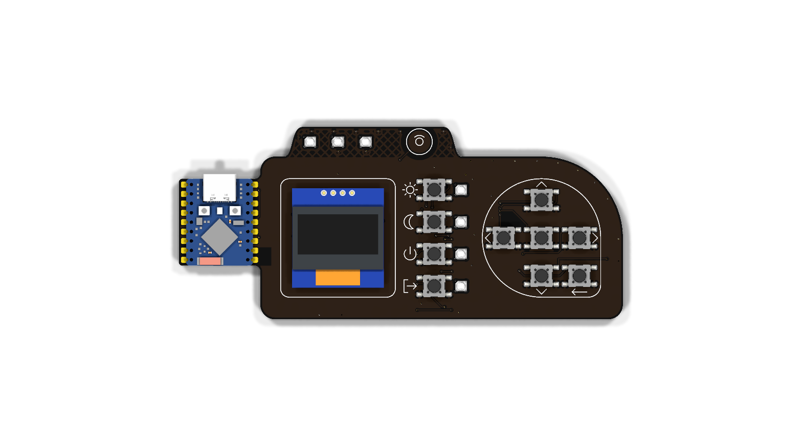
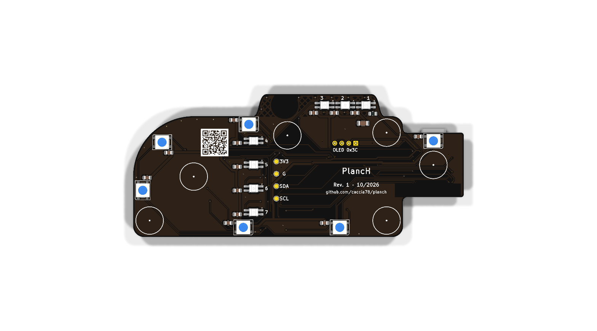

# PlancH

**A desk button panel for Home Assistant.** Ten tactile buttons, a small OLED display, a touch
area and thirteen addressable RGB LEDs on a black PCB that sits on your desk, either on its own
rubber feet or on a 3D-printed stand. Powered by a Waveshare ESP32-S3-Zero running
[ESPHome](https://esphome.io), with native Home Assistant integration.

**📖 Documentation: [caccia78.github.io/PlancH](https://caccia78.github.io/PlancH/)**

https://github.com/user-attachments/assets/00802e42-387a-4095-9ca5-fa8b80f6d39a

*The video is also in [`media/`](media/) (MP4 and WebM).*

> **Status: Rev. 1, prototypes on order.** The design is complete and passes ERC/DRC, but the
> first boards have not been assembled and tested yet. Build one if you like to tinker, and
> expect changes.

## Features

- **10 tactile buttons**: a directional pad (up, down, left, right, OK), Back, and four scene buttons.
- **0.96" OLED display** (SSD1306, 128 × 64, white) for menus and feedback.
- **Capacitive touch area** on the top "ear" to wake the display.
- **13 addressable RGB LEDs** (SK6812): 3 status LEDs, 4 scene LEDs shining through milled
  windows in the PCB, and 6 backlight LEDs that light up the desk underneath.
- **Waveshare ESP32-S3-Zero** module, powered and programmed over USB-C.
- **Hand-solderable**: no parts with contacts under the body, passives 0805 or larger.
- **ESPHome firmware** with native Home Assistant API.
- **Accessories**: a 3D-printed desk stand, with more to come.

| Front | Back |
| --- | --- |
|  |  |

## Build your own

1. **Order the PCB.** Upload `production/gerber/` (or the Gerber ZIP attached to the
   [latest release](../../releases/latest)) to JLCPCB, PCBWay or any other maker.
   Reference settings: 2 layers, 2.0 mm FR4 (1.6 mm works too), matte black solder mask,
   white silkscreen, ENIG finish.
2. **Get the components.** The bill of materials is in
   [`production/planch-bom.csv`](production/planch-bom.csv), with manufacturer part numbers.
3. **Solder.** Open [`production/planch-ibom.html`](production/planch-ibom.html) in a browser:
   the interactive BOM highlights every part on the board. Suggested order: passives and LEDs
   on the back, buttons, ESP32 module, OLED last.
4. **Flash the firmware.** Run `esphome run firmware/planch.yaml` and set the Wi-Fi after
   flashing. Then install the Home Assistant package `homeassistant/planch.yaml` and put the
   label **PlancH** on the devices to control: the panel finds them by itself, by room.
5. **Print a stand** (optional): the [desk stand](mechanical/desk-stand/README.md) or the
   magnetic [wall mount](mechanical/wall-mount/README.md), with ready-to-print 3MF and STL files.

The [project website](https://caccia78.github.io/PlancH/) has the full documentation:
[components with shop links](https://caccia78.github.io/PlancH/build/components/),
[PCB ordering](https://caccia78.github.io/PlancH/build/ordering/), a step-by-step
[assembly guide](https://caccia78.github.io/PlancH/build/assembly/),
[firmware](https://caccia78.github.io/PlancH/firmware/) and
[Home Assistant](https://caccia78.github.io/PlancH/home-assistant/) setup.

## Repository layout

```
hardware/      KiCad 10 project: schematic, PCB, custom symbols, footprints and 3D models
production/    Gerber and drill files, BOM, pick-and-place, interactive BOM, schematic PDF, STEP
mechanical/    3D-printable accessories (build123d sources, STL, 3MF, STEP)
firmware/      ESPHome: planch.yaml (board), planch-bringup.yaml (assembly test), planch-test.yaml (test bench)
homeassistant/ Home Assistant package (menu from labels and areas) and test bench dashboard
media/         renders and video
```

## License

PlancH is open source hardware.

- **Hardware** (KiCad sources, production files, 3D-printed accessories):
  [CERN-OHL-S v2](LICENSES/CERN-OHL-S-2.0.txt)
- **Firmware and scripts**: [MIT](LICENSES/MIT.txt)
- **Documentation, renders and video**: [CC BY-SA 4.0](LICENSES/CC-BY-SA-4.0.txt)

See [LICENSE.md](LICENSE.md) for details. The source location printed on the back of the board
is `github.com/caccia78/planch`.

© 2026 Vincenzo Cacciatore
