# Assembly

From the bare PCB to a working button panel: work order, technique for each part, tricks for
the difficult ones and a test at every step.

**44 components + 6 feet · 2–3 hours for the first board · everything solderable with a
regular iron.**

<figure markdown="span">
  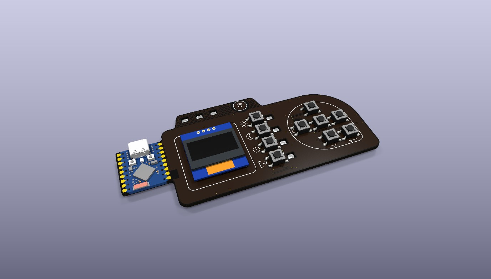
  <figcaption>The result: ESP32 module on the left, display in the middle, scenes and
  directional pad on the right.</figcaption>
</figure>

<figure markdown="span">
  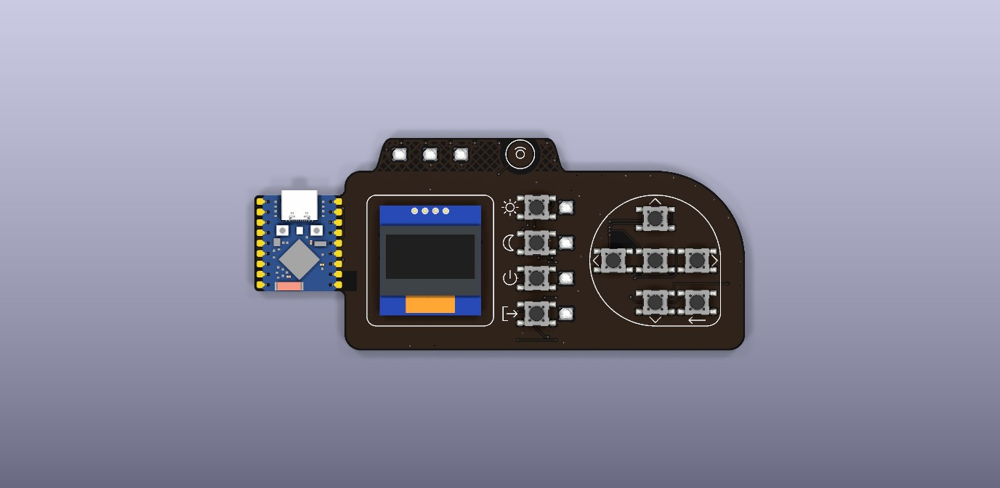
  <figcaption>Front: module, display, 10 buttons, 7 LED windows, touch area.</figcaption>
</figure>
<figure markdown="span">
  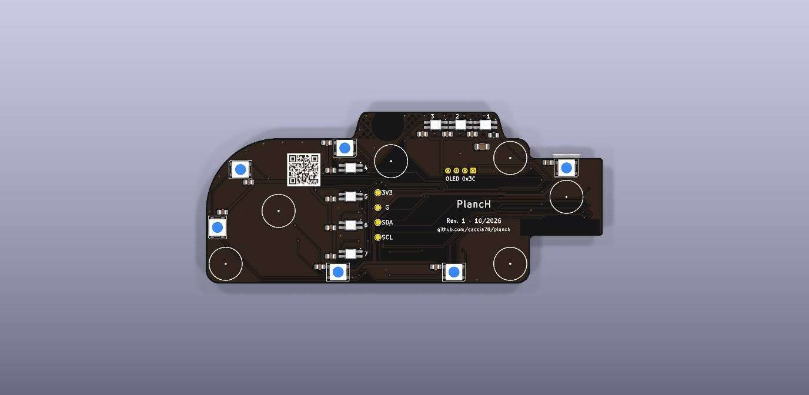
  <figcaption>Back (seen from below): LEDs, passives, test pads, foot circles.</figcaption>
</figure>

## Components

| Ref. | Part | Qty | Side | Package | Difficulty |
| --- | --- | :-: | --- | --- | --- |
| U1 | Waveshare ESP32-S3-Zero (no headers) | 1 | Front | Castellated pads | Medium |
| U2 | 0.96" SSD1306 I²C OLED | 1 | Front | 4 through-hole pins | Medium |
| SW1–SW10 | 6 × 6 × 4.3 mm SMD switch (PTS645 or equivalent) | 10 | Front | Gull-wing | Easy |
| D1–D7 | SK6812MINI-E reverse mount | 7 | Back | 3.2 × 2.8 mm in a window | Hard |
| D8–D13 | 5050 RGB LED (SKC6812RV or WS2812B) | 6 | Back | PLCC4 5 × 5 mm | Medium |
| R1 | 330 Ω | 1 | Back | 0805 | Easy |
| C1–C13 | 100 nF X7R | 13 | Back | 0805 | Easy |
| C14 | 47 µF X5R 10 V | 1 | Back | 1206 | Easy |
| — | Adhesive feet Ø 10 × 5 mm | 6 | Back | Adhesive | — |

!!! info "Substitutions"
    WS2812B instead of SKC6812RV for D8–D13 (mind the orientation, see [step 5](#5-5050-leds-d8d13)),
    TDK C3216X5R1A476M160AB instead of the Samsung part for C14, generic 6 × 6 × 4.3 mm switches
    instead of the C&K ones. See [Components](components.md).

## Tools and materials

**Essential**

- Temperature-controlled soldering iron with a 1.6–2.4 mm chisel tip (passives, castellated
  pads, ground pads) and a 0.8–1 mm conical or fine chisel tip (LEDs).
- 0.5–0.6 mm flux-core solder. Leaded 63/37 or 60/40 melts at a lower temperature and is more
  forgiving; lead-free (SAC305) needs about 30–40 °C more.
- No-clean flux, gel or pen: the real secret for LEDs and castellated pads.
- Fine-tip anti-static tweezers, plus a curved pair.
- 1.5–2 mm desoldering braid.
- Flush cutters (for the OLED pins).
- Multimeter with continuity and diode test.
- A USB-C **data** cable and a computer with ESPHome.

**Very useful**

- Magnifier or microscope (×5–×10) to inspect the LED joints.
- PCB holder or "helping hands": once the module is on, the board no longer lies flat.
- Silicone mat or soft cloth: the matte black front scratches and stains easily.
- Kapton tape to hold parts and protect the front.
- Anti-static wrist strap: the LEDs are sensitive to electrostatic discharge.
- Isopropyl alcohol (≥ 99%), cotton swabs and a soft brush.
- Thick double-sided tape or a 2.5 mm spacer to align the OLED.

**Tip temperatures (indicative)**

| Job | Leaded solder | Lead-free | Contact time |
| --- | --- | --- | --- |
| 0805/1206 passives, switches | 310–330 °C | 340–360 °C | 2–3 s per joint |
| Ground pads, castellated pads | 330–350 °C | 360–380 °C | up to 4 s, wide tip |
| MINI-E and 5050 LEDs | 290–310 °C | 320–340 °C | ≤ 3 s, then let it cool |
| OLED pins | 310–330 °C | 340–360 °C | 2–3 s |

!!! tip
    The board has ground planes on both sides: pads connected to GND sink a lot of heat. A wide
    tip and a few more seconds work better than a fine tip at maximum temperature. If the joint
    stays dull and grainy, add flux and reflow.

## Preparation

- [ ] Inspect the bare PCB with a magnifier: clean edges on the 7 LED windows, no burrs, no
      scratches on the copper, readable silkscreen.
- [ ] Dry-fit a MINI-E LED in a window (from the back): it must drop in without force, with its
      legs resting on the pads. File off any burr with a fine needle file.
- [ ] With the multimeter in continuity mode, check for fabrication shorts between the pads of
      C14 (+5V and GND) and between TP1 (3V3) and TP2 (GND). It must not beep.
- [ ] Open the LED bag only when needed. MINI-Es are moisture sensitive (MSL 5a): if the bag
      has been open for a long time, the Opsco datasheet asks for baking at 70 °C for at
      least 12 hours before soldering.
- [ ] Prepare the assembly test firmware `firmware/planch-bringup.yaml` (see
      [Firmware](../firmware/index.md)): the Wi-Fi is set after flashing, no file to fill in.
- [ ] Work on a soft mat with the front protected: matte black solder mask shows every
      scratch and every drop of flux.

### Test firmware

To test LEDs and buttons as you go, without Home Assistant yet, use the assembly test firmware
[`firmware/planch-bringup.yaml`](https://github.com/caccia78/PlancH/blob/main/firmware/planch-bringup.yaml).
After the first USB flash, open the module's IP address in a browser: you will see the three
LED groups and the state of each button. LEDs not yet mounted are simply ignored. When the
board is complete you switch to the final firmware (step 8).

## Work order

From the lowest parts to the tallest, and the module early so the LED chain can be tested one
group at a time. A rotated LED or a cold joint breaks the whole chain after it: finding it
after 3 LEDs is much easier than after 13.

| # | Stage | Side | Test at the end |
| :-: | --- | --- | --- |
| 1 | Passives: R1, C14, C1–C13 | Back | No short between +5V and GND |
| 2 | ESP32-S3-Zero module | Front | Flash over USB, 5 V and 3.3 V rails |
| 3 | Status LEDs D1–D3 | Back | The 3 LEDs on the ear light up |
| 4 | Scene LEDs D4–D7 | Back | 7 LEDs light up |
| 5 | 5050 LEDs D8–D13 | Back | All 13 LEDs light up |
| 6 | Switches SW1–SW10 | Front | Every button changes state |
| 7 | OLED display | Front | "PlancH" on the display |
| 8 | Cleaning, touch calibration, feet | Both | Final test |

  <i style="background:var(--pl-pad-hl)"></i>pads to solder in this step
  <i style="background:var(--pl-pad);opacity:.55"></i>other pads
  <i style="border:2px solid var(--pl-pin1)"></i>pad 1 (GND on LEDs, + on C14)
  <i style="background:var(--pl-chain)"></i>data path

## 1 · Passives on the back

One resistor and 14 capacitors, all on the back and not polarised (C14 is ceramic). They go
first because they are the lowest: the board still lies flat on the mat, with the front
empty.

<figure class="diagram" markdown>
--8<-- "assembly/00-passives-back.svg"
<figcaption>Back seen from the solder side. C1–C13 sit next to each LED, R1 and C14 below D1
on the ear. The blue circle on C14 marks the +5V pad.</figcaption>
</figure>

<figure class="diagram" markdown>
--8<-- "assembly/01-passive-steps.svg"
<figcaption>The three-step method for SMD passives.</figcaption>
</figure>

- [ ] Put a touch of flux on one pad per component and tin it with a little solder (a small
      shiny bead, not a ball).
- [ ] Pick the part with tweezers, place it and reflow the tinned pad while sliding it into
      position. It must sit flat and centred.
- [ ] Solder the other pad with fresh solder, then touch up the first one for a concave, shiny
      fillet.
- [ ] Suggested order: R1 and C14 on the ear, then C1–C3, C4–C7 (scene column), C8–C13.
- [ ] Inspect with the magnifier: no bridges, no part lifted on one side (tombstoning).

!!! tip
    100 nF ceramic capacitors have no markings: keep the 100 nF and 47 µF tapes apart and take
    one part at a time. C14 (1206) is bigger; R1 has its value printed (331 or 3300).

!!! warning
    If C14 is an SMD electrolytic instead of a ceramic, it is polarised: the pad with the blue
    circle in the drawing is +5V (pad 1), the other is GND.

!!! success "Test"
    The multimeter across the C14 pads must not show a short circuit.

## 2 · ESP32-S3-Zero module

The module is soldered only by its 18 castellated edge pads, 9 per side, with the USB-C
towards the outside of the tab and the antenna at the bottom. The PCB pads extend about
1.4 mm beyond the edge of the module: that is where the iron works.

<figure class="diagram" markdown>
--8<-- "assembly/02-module-pads.svg"
<figcaption>Front: the 18 module pads. Top left is 5V, top right is TX (GP43), which stays
unconnected.</figcaption>
</figure>
<figure markdown="span">
  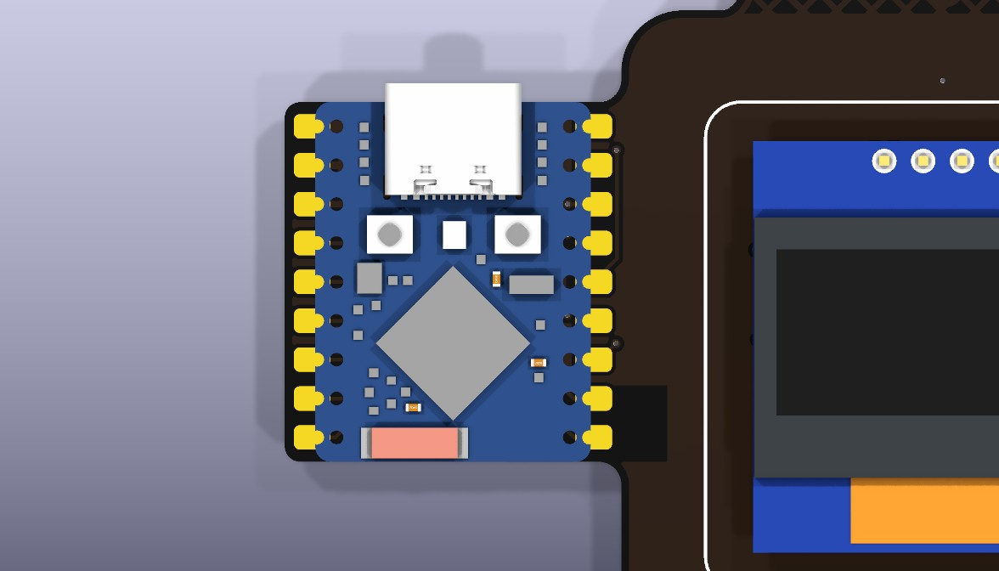
  <figcaption>Module in place, USB beyond the top edge of the tab.</figcaption>
</figure>

<figure class="diagram" markdown>
--8<-- "assembly/03-castellated.svg"
<figcaption>Soldering a castellated pad.</figcaption>
</figure>

- [ ] Flux all 18 PCB pads.
- [ ] Lightly tin a single corner pad, for example GP6 (bottom left).
- [ ] Place the module: USB-C up, past the edge of the tab, module markings readable. Align
      the half-holes with the pads on both sides, looking against the light.
- [ ] Hold the module with a finger or a stick (not with tweezers on its components) and
      reflow the tinned pad.
- [ ] Check the alignment on all 18 pads. Reflow and correct if needed: this is the last easy
      moment to do it.
- [ ] Solder the opposite corner (TX, top right), then all the others: chisel tip on the pad
      and against the half-hole, solder fed from the opposite side of the tip.
- [ ] Check with the magnifier that solder has climbed into every half-hole and that there are
      no bridges between neighbouring pads (2.54 mm pitch).

!!! tip
    The solder should form a small ramp from the pad into the half-hole. If it stays as a ball
    on the pad without wetting the half-hole, add flux and hold the tip one more second,
    pressing lightly towards the module.

!!! warning
    - The module also has pads on its underside: they are not soldered and must not touch
      anything. Under the module the PCB has only solder mask and tented vias, but leave no
      solder drops there.
    - Do not solder with the USB cable plugged in.
    - The TX pad (GP43) has no connection: you can solder it for mechanical strength.

!!! success "Test"
    - Plug in USB: the computer must detect the device. If it does not, hold the module's BOOT
      button while plugging in the cable.
    - Flash with `esphome run firmware/planch-bringup.yaml`, then set the Wi-Fi from
      [web.esphome.io](https://web.esphome.io) (**Configure Wi-Fi**) or from the **PlancH**
      hotspot the board opens.
    - Measure about 5 V across the C14 pads and about 3.3 V between TP1 and TP2.
    - The ESPHome log shows the module joining Wi-Fi.

<figure markdown="span">
  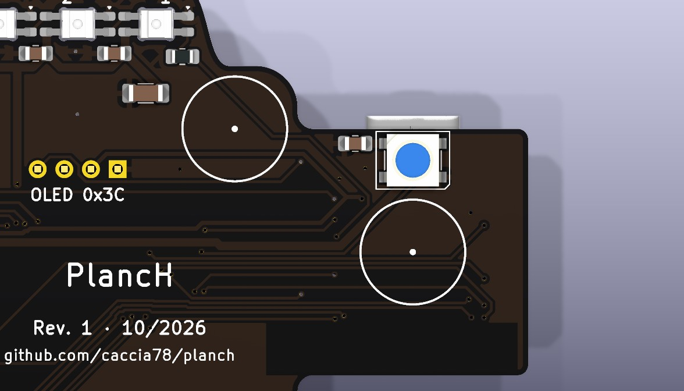
  <figcaption>On the back, behind the module, are D13 and C13: they are soldered in step 5.
  The circle is foot F1.</figcaption>
</figure>

## 3 · Status LEDs D1–D3 (reverse mount)

The MINI-Es are the most delicate step. They are mounted from the back, upside down: the body
goes into the milled window, the lens faces the front and the four legs rest on the pads on
the back.

<figure class="diagram" markdown>
--8<-- "assembly/04-minie-section.svg"
<figcaption>Cross-section: LED inserted from the back into its window, board front-down on
the work surface.</figcaption>
</figure>

<figure class="diagram" markdown>
--8<-- "assembly/05-status-leds.svg"
<figcaption>Back of the ear: D1 is the closest to R1 and C14. The blue circle is pad 1 (GND),
marked on the silkscreen by a small triangle.</figcaption>
</figure>
<figure markdown="span">
  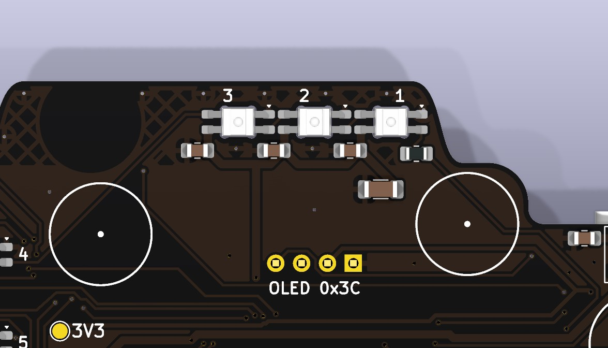
  <figcaption>Numbers 1–3, triangles on the GND pads, R1 and C14 below D1.</figcaption>
</figure>

**Orientation.** In the KiCad schematic the MINI-E pins are numbered 1 GND, 2 DIN, 3 VDD,
4 DOUT; the Opsco datasheet numbers them differently (1 VDD, 2 DOUT, 3 GND, 4 DIN), but the
physical position is the same. What matters: **the LED's GND pin goes on the pad with the
triangle.**

!!! tip "Finding GND"
    If you are not sure which pin is GND, use the multimeter's diode test: red probe on the GND
    pin and black on VDD usually reads about 0.5–0.7 V (internal protection diode); with the
    probes swapped it reads nothing. Try it on a spare LED before mounting.

- [ ] Lay the board front-down on the mat. If the module makes it rock, put a shim under the
      other end or use a holder: the ear area must lie flat.
- [ ] Flux the 4 pads of D1.
- [ ] With tweezers, drop D1 into the window, lens down, GND towards the triangle. The LED
      rests on its legs by itself.
- [ ] Centre the body in the window, then touch a single leg with the fine tip and very little
      solder: enough to hold it.
- [ ] Check from the front (lifting the board carefully) that the lens is centred in the
      window and not tilted. Correct it now if needed.
- [ ] Solder the other three legs: short contact (≤ 3 s), then touch up the first one.
- [ ] Repeat for D2 and D3. Pause between LEDs so the area does not overheat.

!!! warning
    - Never press on the lens or the body with tweezers or the iron: the silicone deforms and
      the die inside gets damaged.
    - Do not insist with heat: if the solder does not wet, lift the tip, add flux and try again
      after a few seconds.
    - Some solvents attack the resin: clean only with a little isopropyl alcohol, never
      acetone.

!!! success "Test"
    Power the module and switch on the **Status LEDs** group in the ESPHome web page: D1, D2
    and D3 must light up with the same colour. If only D1 lights up, check the DOUT joint of D1
    and the DIN joint of D2.

<figure markdown="span">
  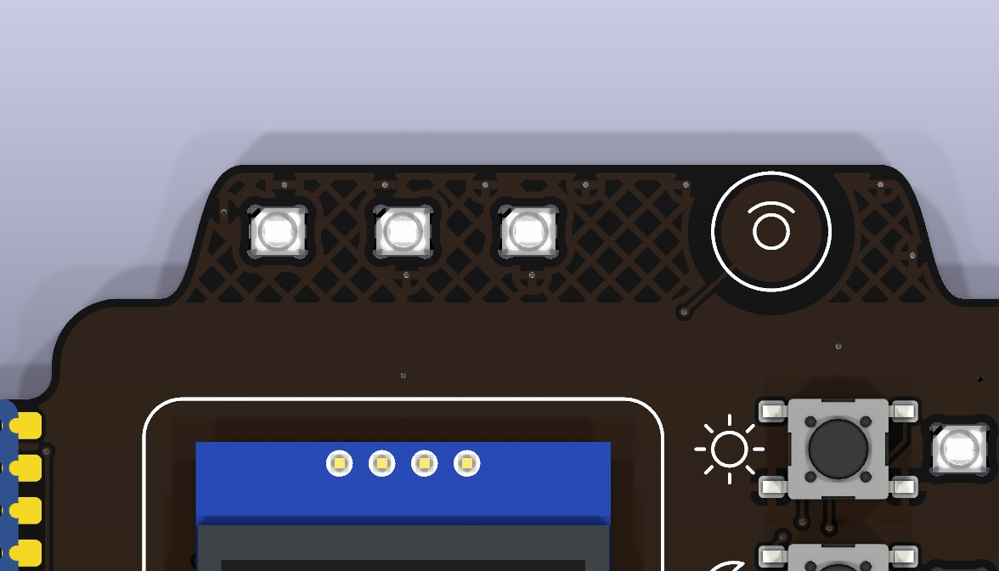
  <figcaption>From the front: the three status LED windows and the touch area on the
  right.</figcaption>
</figure>

## 4 · Scene LEDs D4–D7

Same technique as the status LEDs. The four LEDs sit in a column next to the scene buttons,
each with its capacitor already soldered.

<figure class="diagram" markdown>
--8<-- "assembly/06-scene-leds.svg"
<figcaption>Back: D4 at the top (next to Scene 1), D7 at the bottom. The GND pad is always on
the same side.</figcaption>
</figure>
<figure markdown="span">
  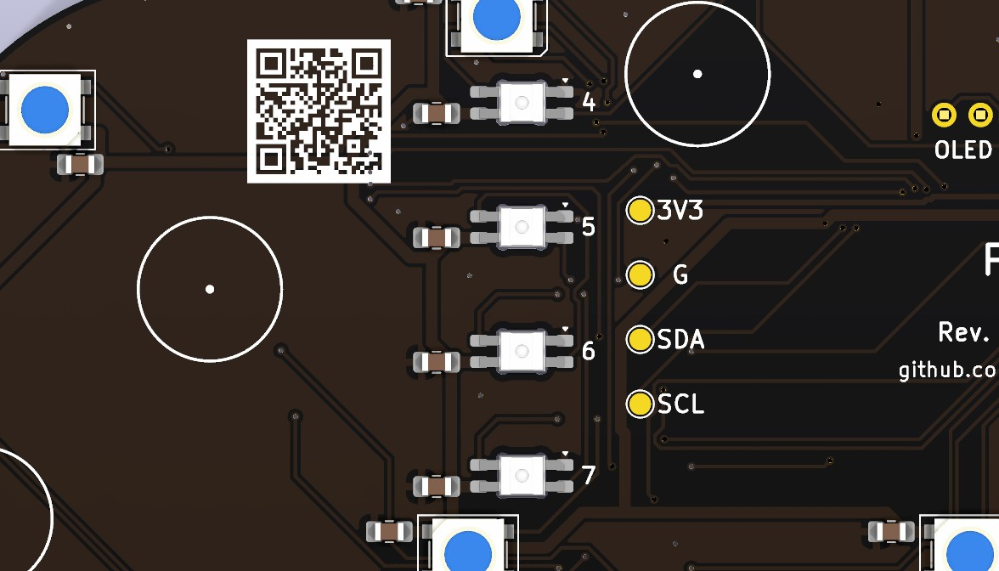
  <figcaption>Numbers 4–7, test pads 3V3, G, SDA and SCL on the right.</figcaption>
</figure>

- [ ] Board front-down, column area flat.
- [ ] Mount D4, D5, D6 and D7 as for the status LEDs: one leg, check from the front, the
      other three.
- [ ] All four have the same orientation: compare them before soldering the second leg.

!!! success "Test"
    Switch on the **Scene LEDs** group: D4–D7 must light up. If the chain stops at a given LED,
    the fault is almost always in that LED or in the DOUT joint of the previous one.

<figure markdown="span">
  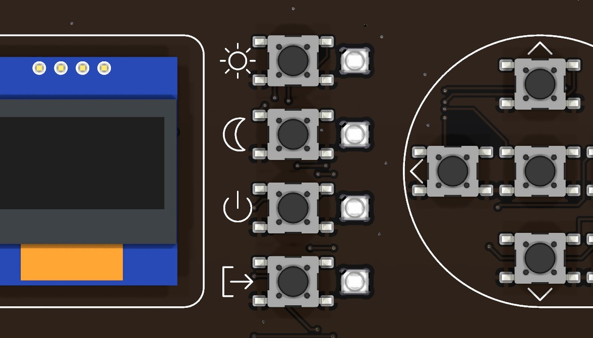
  <figcaption>From the front: the windows to the right of each scene button.</figcaption>
</figure>

## 5 · 5050 LEDs D8–D13

The six backlight LEDs shine towards the desk. They are bigger and sturdier than the MINI-Es,
but have more thermal mass and four pads sticking out on the sides of the body.

<figure class="diagram" markdown>
--8<-- "assembly/07-led-chain.svg"
<figcaption>Back with the data path: R1 → D1 … D7 → D8 → D9 → D10 → D11 → D12 → D13. D9 is
rotated by 90°, D10 by 180°: always follow the chamfer on the silkscreen, not the direction of
the other LEDs.</figcaption>
</figure>

<figure markdown="span">
  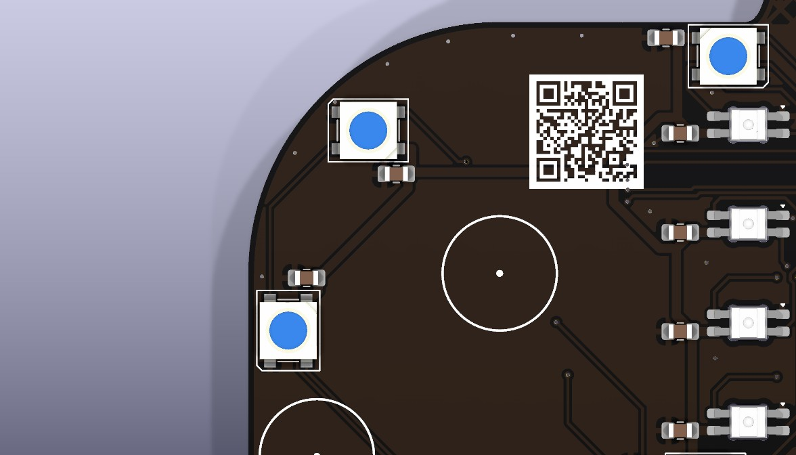
  <figcaption>D9, D10, D11 with the silkscreen chamfer on the pad 1 corner.</figcaption>
</figure>
<figure class="diagram" markdown>
--8<-- "assembly/08-5050-soldering.svg"
<figcaption>Soldering a 5050: the tip heats the part of the pad outside the body.</figcaption>
</figure>

**Orientation.**

- **SKC6812RV** (part in the BOM): pin 1 GND, 2 DIN, 3 VDD, 4 DOUT, same as the footprint.
  Pin 1 goes on the chamfered corner of the silkscreen.
- **WS2812B** (common alternative): numbered 1 VDD, 2 DOUT, 3 VSS, 4 DIN. The physical layout is
  the same rotated by 180°: **the VSS pin goes on the chamfered corner.** The mark on the
  WS2812B body may therefore not match the chamfer: orient it by function.

!!! tip "A test LED"
    Before mounting a new type of 5050, use the diode test (red on GND, black on VDD: about
    0.5–0.7 V) to find which corner is GND and compare it with the seller's datasheet drawing.

- [ ] Flux the 4 pads of the LED.
- [ ] Tin one corner pad, place the LED with the right chamfer and reflow the pad so it
      settles flat.
- [ ] Solder the other three pads heating the protruding part: the solder flows under the
      lead.
- [ ] GND pads are connected to the ground plane: use the widest tip and a few more seconds.
- [ ] Follow the chain order: D8, D9, D10, D11, D12, D13. D13 is behind the module.

!!! warning
    - RGBW LEDs are different: if one is RGBW by mistake, every colour after it is wrong.
    - Do not mix 5050 LEDs with different housings on the same board if you care about even
      light on the desk.

!!! success "Test"
    Switch on the **Backlight** group: all 6 downward LEDs must light up. Try pure red, green
    and blue to check that the colour order is right along the whole chain.

## 6 · Switches SW1–SW10

Ten identical switches, all at 0°, with legs on the left and right. Rotated by 180° a switch
works the same; rotated by 90° the legs miss the pads, so the orientation is forced.

<figure class="diagram" markdown>
--8<-- "assembly/09-buttons.svg"
<figcaption>Front: scene column SW7–SW10 and directional pad with OK in the centre and Back at
the bottom right.</figcaption>
</figure>

<figure markdown="span">
  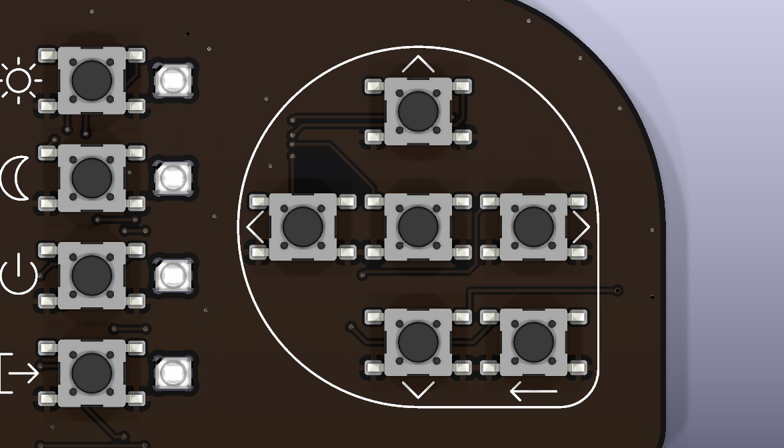
  <figcaption>Directional pad at 10.25 mm pitch: SW3, SW5 and SW4 on the same row; SW1, SW5
  and SW2 on the same column.</figcaption>
</figure>
<figure markdown="span">
  
  <figcaption>Scene column at 8.67 mm pitch.</figcaption>
</figure>

- [ ] From now on the board is worked front-up: rest it on a support that does not press on the
      LEDs on the back (for example two strips of wood under the edges).
- [ ] Very little flux, only on the pads: flux that gets into the mechanism makes the button
      sticky.
- [ ] Tin one pad per switch (always the same one, for example top left).
- [ ] Place the switch, reflow the pad and press lightly on the body (not the actuator) so it
      sits flat.
- [ ] Before soldering the other legs, check the alignment with rows and columns: a ruler laid
      on the bodies makes it obvious.
- [ ] Solder the other three legs with short contact. The plastic body does not like long
      heat.
- [ ] Press every button: the click must be crisp and the same for all.

!!! tip
    Solder them in aligned groups (SW3, SW5, SW4, then SW1 and SW2, then SW6) and the scene
    column all together: keeping the same line is easier.

!!! success "Test"
    In the ESPHome web page every button must go to "ON" while pressed. If one stays always
    pressed, look for a solder bridge between the GND legs and the signal legs.

## 7 · OLED display

The OLED goes last: it is the tallest and most fragile part. It is held only by the row of
4 pins at the top, so its bottom edge must be supported to keep it parallel to the board.

<figure class="diagram" markdown>
--8<-- "assembly/10-oled-pins.svg"
<figcaption>Front: the pin row at the top. GND on the left (square pad), then VIN, SCK,
SDA.</figcaption>
</figure>
<figure class="diagram" markdown>
--8<-- "assembly/11-oled-side.svg"
<figcaption>Side view: header, temporary spacer under the bottom edge, pins trimmed flush on
the back.</figcaption>
</figure>

- [ ] Check the pin order on the module: it must be **GND, VIN, SCK, SDA** from the left, looking
      at the display from the front with the pins at the top. It matches the "OLED 0x3C"
      silkscreen on the back.
- [ ] Leave the protective film on the glass until the end.
- [ ] If the header is not already soldered to the module, solder it to the module first, with
      the plastic on the OLED component side.
- [ ] Insert the pins from the front. Put a temporary spacer as tall as the header plastic
      (about 2.5 mm) under the bottom edge of the module: a piece of thick double-sided tape
      or rubber.
- [ ] Flip the board and solder a single pin from the back. Check that the display is parallel
      and centred in the silkscreen frame, then solder the other three.
- [ ] Trim the pins flush with the cutters and briefly reflow each joint: nothing must stick
      out on the back to scratch the desk.
- [ ] Remove the temporary spacer, or leave it if it is double-sided tape and keeps the display
      parallel.

!!! tip
    If you trim the pins before soldering, the joint comes out lower and cleaner: insert, cut
    leaving 0.5 mm, then solder.

!!! warning
    Do not heat for long near the glass and do not clean the display with alcohol: the
    polariser film turns cloudy.

!!! success "Test"
    - With the module unpowered, measure between TP3 (SDA) and TP1 (3V3), then between TP4
      (SCL) and TP1: 2–10 kΩ means the OLED pull-ups are there.
    - Power on: the display shows "PlancH" and the ESPHome log finds the device at address
      0x3C.

## 8 · Cleaning, touch area and feet

<figure class="diagram" markdown>
--8<-- "assembly/12-feet-testpads.svg"
<figcaption>Back: circles of the 6 feet F1–F6 and test pads TP1–TP4.</figcaption>
</figure>

**Cleaning**

- No-clean flux can stay, but on matte black it leaves shiny stains: wipe them with a cotton
  swab barely dampened with isopropyl alcohol.
- No immersion, no ultrasonic cleaning: liquid and residue would get into the switches and
  the display.
- Around the LEDs use very little alcohol and let it dry well.

**Touch area.** The E1 electrode is a copper disc under the solder mask: nothing to solder.
Keep it clean, with no tape or flux residue.

- [ ] Clean flux residue on both sides.
- [ ] With the test firmware (`setup_mode: true` under `esp32_touch`) read the touch values in
      the log at rest and with a finger on the ear: the threshold goes about halfway.
- [ ] In the final firmware `firmware/planch.yaml` set that `threshold` and `setup_mode: false`,
      then flash it (USB or over Wi-Fi): from now on the display shows the menu, see
      [Home Assistant](../home-assistant/index.md).
- [ ] Clean the foot circles with alcohol, let them dry and stick the 6 feet centred on the
      silkscreen circles. Press each one for 10 seconds.
- [ ] Put the board on the desk: it must not rock and no LED must touch the surface.

!!! note
    The 5 mm feet keep the 5050 LEDs off the desk: the light spreads over the surface instead
    of making a spot.

## Final test

| Check | Where | Expected |
| --- | --- | --- |
| LED supply | C14 pads | 4.8–5.2 V with USB connected |
| Logic supply | TP1 – TP2 | 3.2–3.4 V |
| I²C pull-ups (board off) | TP3 – TP1, TP4 – TP1 | 2–10 kΩ |
| Display | ESPHome log | Device found at 0x3C, text visible |
| LED chain | Test firmware web page | 13 LEDs, pure colours correct |
| Buttons | Test firmware web page | 10 buttons, one state change per press |
| Touch | ESPHome log | Triggers only with a finger on the ear |
| Menu | Final firmware | Rooms and devices from Home Assistant on the display |

Then follow [Home Assistant](../home-assistant/index.md) to choose the devices and the scenes
of the panel.

## Troubleshooting

| Symptom | Likely cause | Fix |
| --- | --- | --- |
| The computer does not see the module | Charge-only cable, module not in download mode | Data cable; hold BOOT while plugging in USB |
| No LED lights up | R1 or D1 not soldered, D1 rotated | Check R1, the orientation of D1 and the 5 V on C14 |
| The chain stops at LED N | LED N rotated or cold DIN/DOUT joint | Reflow DOUT of LED N-1 and DIN of LED N with flux; then check the orientation of LED N |
| Wrong colours after a given LED | An RGBW LED in the chain | Replace it with an RGB one |
| The first LED flickers or shows random colours | 3.3 V data signal at the edge of the threshold | Try another D1; if it persists, a level shifter is needed (design change) |
| A button is always pressed | Solder bridge or flux in the mechanism | Remove the bridge with braid; if the click is soft, replace the switch |
| Black display | Pin order, cold joint, different address | Check GND/VIN/SCK/SDA; the I²C log shows the address found |
| The touch triggers by itself | Threshold too close to the resting value | Repeat the calibration with `setup_mode: true` |
| A MINI-E lens tilted in its window | LED soldered at an angle | Reflow one leg at a time with flux, pushing the LED with a wooden stick |
