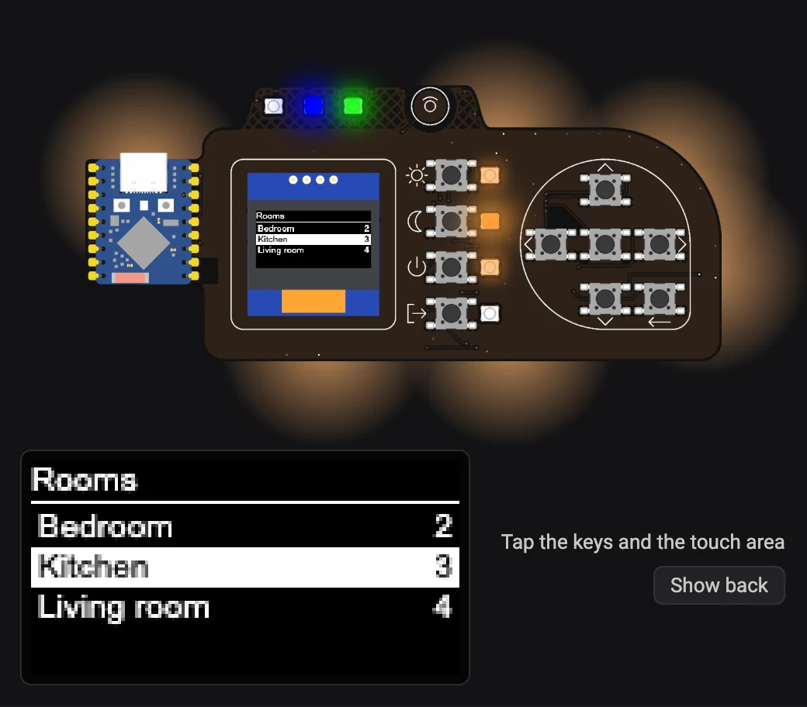

# Try it without the hardware

You can try PlancH with your own Home Assistant before building one: the same firmware runs on
any ESP32 development board with nothing connected (the "test bench"), and a Home Assistant card
draws the panel on its picture. The display shows your rooms and devices, the LEDs light up, and
you press the keys on the screen.

<figure markdown="span">
  { width="520" }
  <figcaption>The PlancH card: display (enlarged below), LEDs, backlight glow, keys to tap.</figcaption>
</figure>

It is also how the firmware is developed: everything on the
[Firmware](index.md) and [Home Assistant](../home-assistant/index.md) pages works the same way.

## What you need

- A classic **ESP32** development board (ESP-WROOM-32, "ESP32 DevKit" and similar). The ESP32-S3
  is not needed: that is for the real PlancH.
- A USB **data** cable, and Chrome or Edge on a computer.
- Home Assistant with the [PlancH package](../home-assistant/index.md#1-install-the-planch-package)
  installed and a few devices with the label **PlancH**.

## 1 · Install the test bench

<script type="module" src="https://unpkg.com/esp-web-tools@10.4.0/dist/web/install-button.js?module"></script>

<p>
  <esp-web-install-button manifest="/PlancH/firmware/install/manifest-test.json">
    <span slot="unsupported">This browser cannot talk to USB devices: open the page in Chrome or Edge on a computer.</span>
    <span slot="not-allowed">The installer needs a secure (https) page.</span>
  </esp-web-install-button>
</p>

1. Connect the board and press **Connect**. Many ESP32 boards do not enter programming mode by
   themselves: if the installer stops at "Connecting…", hold the **BOOT** button while it
   connects.
2. Choose **Install PlancH test bench**, then **Configure Wi-Fi** at the end.
3. Home Assistant finds **PlancH test** under **Settings → Devices & services**: add it, then
   open its options (**Configure**) and enable **Allow the device to perform Home Assistant
   actions**.

The board shows up with a button for each key (Up, Down, Left, Right, OK, Back, Scene 1–4,
Touch), two text sensors with what the display and the 13 LEDs would show (**Screen** and
**LEDs**), and the lights **Status LED 2**, **Status LED 3** and **Backlight**.

## 2 · Install the card

1. Copy the folder
   [`homeassistant/www/planch/`](https://github.com/caccia78/PlancH/tree/main/homeassistant/www/planch)
   (`planch-card.js` and the two pictures) into the `www` folder of your Home Assistant
   configuration (next to `configuration.yaml`), so that you have `www/planch/planch-card.js`.
   If the `www` folder did not exist, restart Home Assistant once.
2. **Settings → Dashboards → ⋮ → Resources → Add resource**: URL
   `/local/planch/planch-card.js?v=1.1`, type **JavaScript module**. (No Resources menu? Turn on
   *Advanced mode* in your user profile.)
3. Reload the browser page.

!!! tip "After updating the card"
    Browsers keep the old card in their cache: after copying a new `planch-card.js`, change the
    number after `?v=` in the resource URL and reload. The browser console shows the version that
    is loaded (**PLANCH-CARD 1.1**).

## 3 · Add the card to a dashboard

The quickest way is the ready-made dashboard
[`homeassistant/planch-test-dashboard.yaml`](https://github.com/caccia78/PlancH/blob/main/homeassistant/planch-test-dashboard.yaml):
create a new dashboard, open **⋮ → Edit dashboard → ⋮ → Raw configuration editor** and paste the
file. It has the card with the lights of the panel, and a second view with the same data as text.

Or add the card to any dashboard:

```yaml
type: custom:planch-card
device: planch_test   # prefix of the entity IDs of the board
```

| Option | Default | Meaning |
| --- | --- | --- |
| `device` | `planch_test` | Prefix of the entity IDs (`sensor.<device>_screen`, `button.<device>_ok`, …) |
| `screen`, `leds` | from `device` | The two text sensors, if they have other IDs |
| `buttons` | `button.<device>_` | Prefix of the key buttons |
| `images` | `/local/planch` | Folder of the two pictures |
| `zoom` | `true` | `false` hides the enlarged display under the board |

## Using it

- **Tap** the keys and the touch area on the picture: the display and the LEDs answer as on the
  real panel. The display is also drawn larger under the board, since the real one is only
  22 × 11 mm.
- **Show back** turns the board over: the six backlight LEDs on the back, lit with the colour of
  the **Backlight** light. On the front they show as a glow around the board.
- The keys and LEDs behave as described on the [Firmware](index.md#keys-and-display) page.
