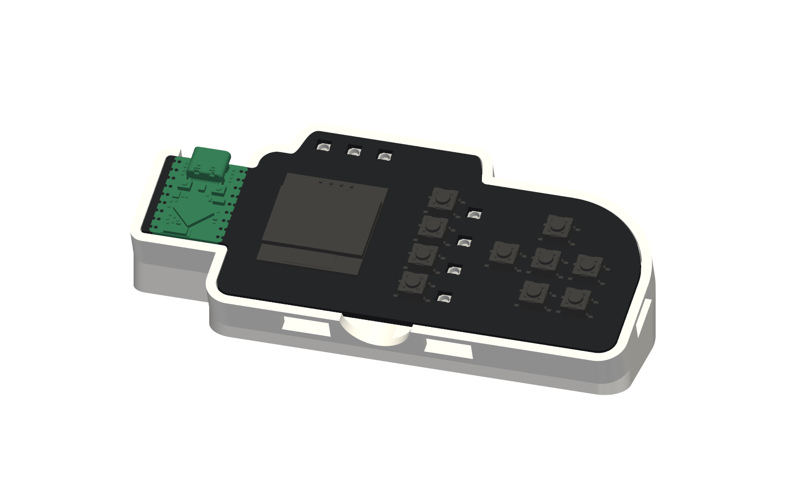

# Desk stand

A 3D-printed stand that holds PlancH at 20° on the desk. The board keeps its rubber feet and
simply drops into a frame that follows its outline; slots in the frame let the backlight LEDs
shine out.



## Files

| File | Use |
| --- | --- |
| `planch-desk-stand.3mf` | Ready for Bambu Studio / PrusaSlicer, already oriented |
| `planch-desk-stand.stl` | Any slicer |
| `planch-desk-stand.step` | CAD |
| `leggio.py` | Parametric source ([build123d](https://github.com/gumyr/build123d)) |

## Printing

- PLA, printed on its base, no supports. Tested settings: Bambu Lab A1, 0.2 mm layers, 15% infill.
- White or light PLA works best: the inside of the frame reflects the backlight through the slots.
- Four 10 mm rubber bumpers go in the recesses underneath.

## Fit

The frame is sized for the board with its 5 mm feet and a 0.3 mm gap on every side. If your
printer runs tight or your feet are taller, regenerate the model:

```bash
uv run --no-project --python 3.12 --with build123d python leggio.py \
    --board ../../production/planch.step --out . --feet 6 --pcb 1.6
```

`--pcb` is the board thickness (2.0 mm by default, 1.6 mm for thinner boards), `--feet` the
height of the rubber feet. The script writes `leggio.*` files ("leggio" is Italian for
"stand").
