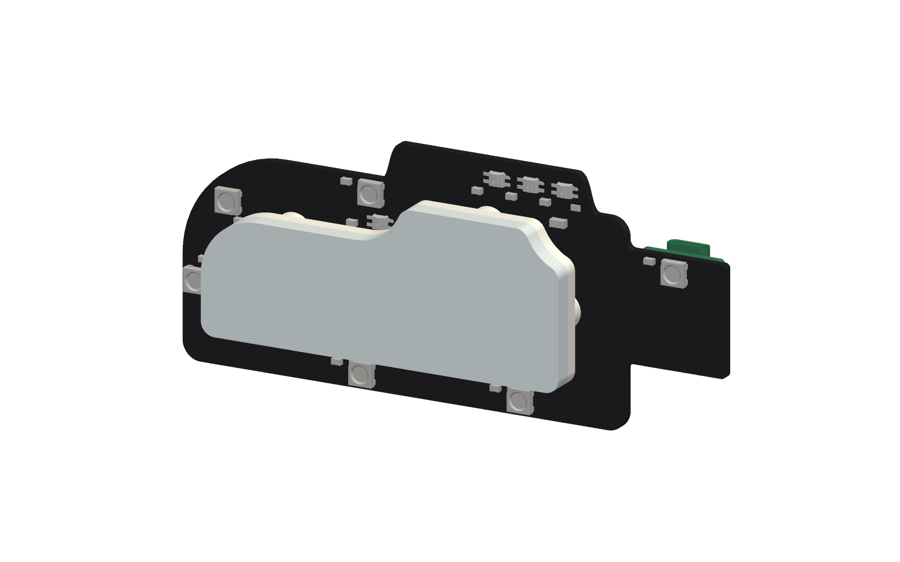

# Wall mount

Hangs PlancH on a wall or any flat vertical surface. A ring bracket is glued behind the board in
place of the rubber feet, a base is stuck to the wall with removable adhesive strips, and six
5 × 3 mm magnets plus two centring cones hold them together. Both parts follow the board outline
9.5 mm in, so the backlight LEDs shine on the wall around them.



Full instructions (parts list, magnet polarity, assembly) on the
[project website](https://caccia78.github.io/PlancH/accessories/wall-mount/).

## Files

| File | Use |
| --- | --- |
| `planch-wall-bracket.3mf`, `planch-wall-base.3mf` | Ready for Bambu Studio / PrusaSlicer, already oriented |
| `planch-wall-bracket.stl`, `planch-wall-base.stl` | Any slicer |
| `planch-wall-bracket.step`, `planch-wall-base.step` | CAD |
| `parete.py` | Parametric source ([build123d](https://github.com/gumyr/build123d) and shapely) |

## Printing

- PLA, both parts with the wall side on the bed, no supports.
- White or light PLA for the base: it sits in the backlight.

## Changing it

```bash
uv run --no-project --python 3.12 --with build123d --with shapely python parete.py \
    --board ../../production/planch.step --out .
```

The script writes `parete-staffa` (bracket) and `parete-base` (base) files ("parete" is Italian
for "wall", "staffa" for "bracket") and checks that the pads avoid the components on the back
and that no part covers the backlight LEDs.
